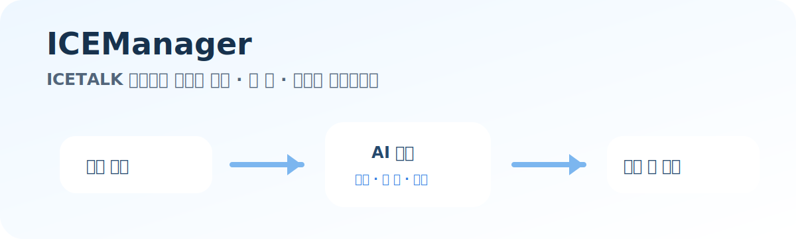
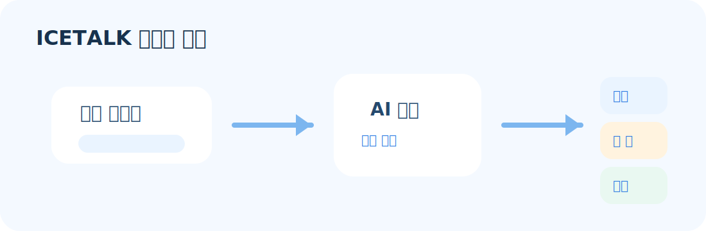
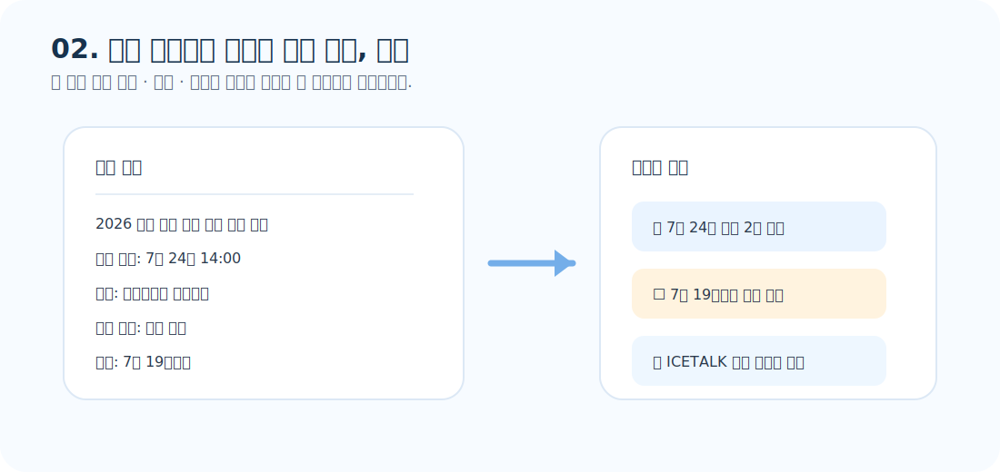
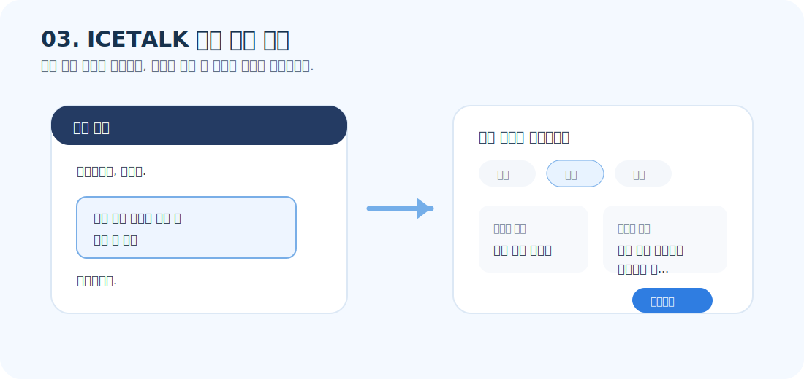
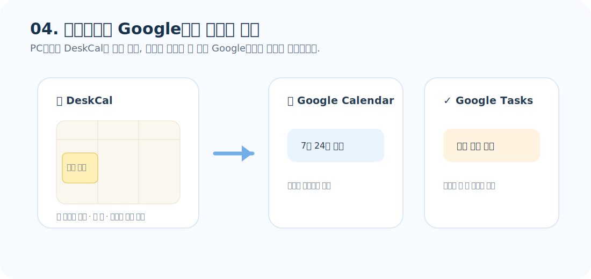

# ICEManager

> **조금 덜 번거롭게 일할 수 있으면 좋겠다고 생각했습니다.**  
> ICETALK 메시지와 공문을 확인한 뒤 반복하던 작은 과정을 줄여보려고 만든 도구입니다.

ICEManager는 ICETALK 메시지와 공문에서 필요한 일정, 할 일, 메모, 안내 내용을 정리하고,  
확인한 내용을 바탕화면 캘린더와 Google Calendar, Google Tasks에서 이어서 볼 수 있도록 돕습니다.

---

## 받은 내용에서 필요한 것만 골라 정리합니다

- ICETALK 메시지와 공문 → 일정 · 할 일 · 메모 · 안내 메시지
- 정리한 일정과 할 일 → 바탕화면 · Google Calendar · Google Tasks
- 작성 중인 ICETALK 문장 → 친근 · 공손 · 정중한 표현으로 다듬기

---

## 01. ICETALK 메시지에서 필요한 내용 추출, 정리

받은 ICETALK 메시지 중 일정이나 할 일이 담긴 문장을 선택하면,  
AI가 내용을 확인하고 일정, 할 일, 메모로 나누어 정리합니다.

정리된 내용은 사용자가 확인한 뒤 저장합니다.

---

## 02. 공문 본문에서 일정과 안내 추출, 정리

업무관리시스템에서 공문의 본문을 복사하면,  
긴 문서 안의 일정, 마감, 안내에 필요한 내용을 한 화면에서 확인할 수 있습니다.

필요한 경우 ICETALK 안내 메시지 초안도 함께 만들 수 있습니다.

---

## 03. ICETALK 작성 문장 정제

작성 중인 ICETALK 메시지를 선택하고 말투를 고르면,  
원문과 다듬은 문장을 나란히 확인한 뒤 작성창에 반영할 수 있습니다.

친근하게, 공손하게, 정중하게 등 상황에 맞는 표현을 고를 수 있도록 구성했습니다.

---

## 04. 바탕화면과 Google에서 이어서 확인

정리한 일정과 할 일은 바탕화면 캘린더에서 바로 확인할 수 있고,  
필요한 경우 Google Calendar와 Google Tasks에서도 이어서 확인할 수 있습니다.

연결 여부와 동기화할 항목은 사용자가 선택합니다.

---

## 이런 상황에서 만들었습니다

업무 중에는 크지 않아 보이지만 손이 많이 가는 일이 자주 생깁니다.

- ICETALK 메시지를 받은 뒤 일정이나 할 일을 따로 기록하기
- 공문 본문을 확인한 뒤 마감일, 제출일, 안내 내용을 다시 정리하기
- 받은 내용을 바탕으로 전체 안내 메시지를 새로 작성하기
- 작성한 메시지를 별도 AI 도구에서 다듬고 다시 복사해 붙여넣기
- 바탕화면 캘린더와 Google Calendar, Google Tasks를 따로 확인하기

IceManager는 이런 작은 반복을 조금 줄여보려는 시도에서 시작했습니다.

---

## 지향하는 방향

IceManager는 완벽한 자동화를 목표로 하기보다,  
업무 중간중간 반복되는 정리 과정을 덜 번거롭게 만드는 데 초점을 둡니다.

그래서 결과를 바로 저장하기보다,  
사용자가 한 번 확인하고 필요한 내용만 반영하는 흐름을 중요하게 생각합니다.

> **IceManager는 항상 곁에서 소통을 돕습니다.**

---

## 현재 상태

개인 업무 환경에서 시작된 도구이며, 실제 사용 흐름에 맞춰 계속 다듬고 있습니다.

현재는 다음 흐름을 중심으로 개선 중입니다.

- ICETALK 메시지 기반 일정·할 일 정리
- 공문 본문 기반 일정·마감·안내 내용 정리
- ICETALK 안내 메시지 작성 및 문장 다듬기
- 바탕화면 캘린더, Google Calendar, Google Tasks 연계

---

## 주의

이 저장소는 ICEManager 소개와 배포 준비를 위한 공간입니다.  
실제 사용 환경, 설치 방식, API 키 설정 방식은 배포 형태에 따라 달라질 수 있습니다.

API 키나 개인 설정 파일은 저장소에 포함하지 않는 것을 원칙으로 합니다.
